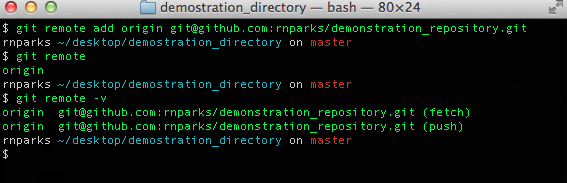

#Homework Day 2
##w01_d02_code_snippets.md
###Ryan Parks

Commands | Description
-------- | -----------
`git remote -v`  | checks if a folder is linked to a repository
`git remote add origin <SSH>`  | adds a folder to a Github respository    
`git remote add upstream <SSH>` | Adds an upstream repository
`git push origin master` | pushes files up to a Github repository
`git pull upstream master` | pulls/fetches files from an upstream directory 
`git clone <SSH>`  |  creates a copy of a Github directory
`ruby <file name>`   | executes a ruby file directly from the command line
`pry`   | moves from bash to a ruby REPL (read, eval, print, loop).  This allows use type ruby code directly into the terminal
`exit`   |  exits pry and gets us back to bash
`ll`   |  list files (including hidden files) from a directory in long form
`git add .`   | adds all files in a directory to commit changes
`git commit -m`   | saves comments and tracks changes after files have been added

